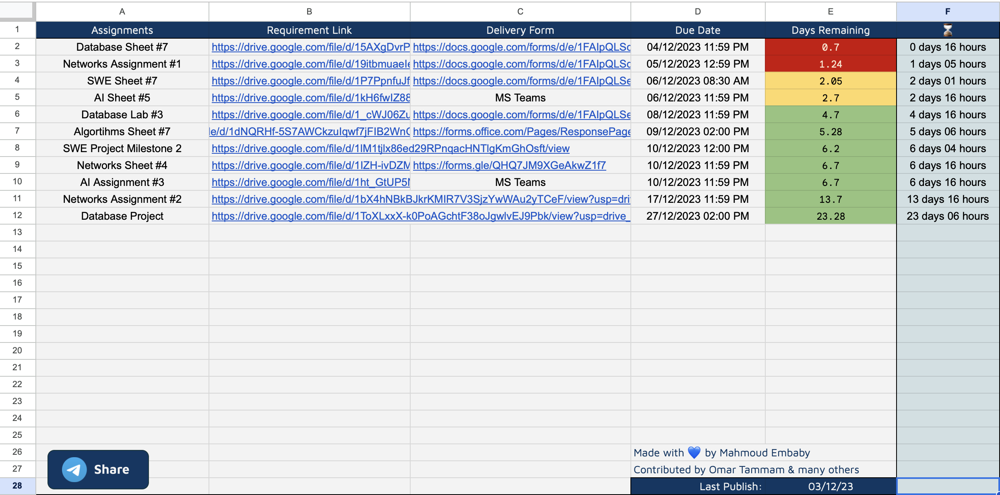
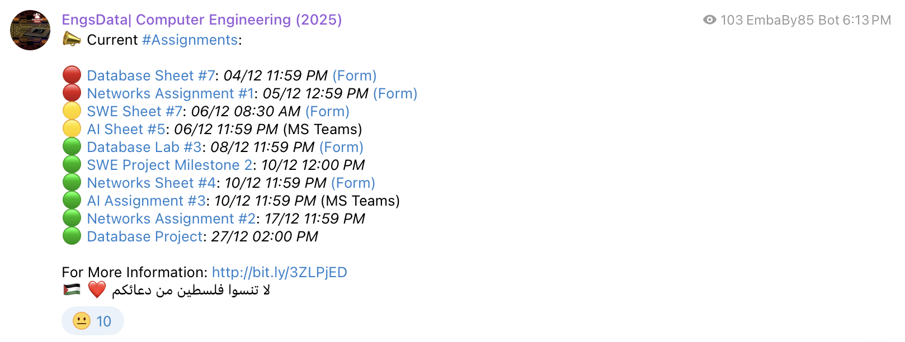

# CSED25-Assignment-Publisher
A Google Apps Script to automate the publishing of assignments from Google Docs to a Telegram channel. This script fetches assignments from a specified Google Sheets document, formats them with markdown, and posts them to Telegram using the bot API. It includes features like assignment urgency indicators, link formatting, and a check to prevent duplicate posts on the same day. Ideal for educators and teams to streamline assignment notifications.

## Usage
### Google Sheets

#### Sheet Format
- The script is built to work for Google Spreadsheets with the following columns:
    - `Assignments` assignment title (<i>can't be empty</i>).
    - `Requirement Link` link to assignment document / requirements (<i>link</i> or <i>text</i>).
    - `Delivery Form` link to delivery form (<i>link</i> or <i>text</i>).
    - `Due Date` assignment due date (<i>date format</i>).

- Feel free to clone the main spreadsheet ([CSED 25: Task Manager](https://docs.google.com/spreadsheets/d/1_v2hNSKjT6_v5l2cpWHZUL1ZcMc_UuxZmUwRyqzhQD0/edit#gid=0)) and make the required modifications to meet your requirements.

#### Using the Apps Script in Google Sheets
- Open the target Google Spreadsheet.
- On the main menu, go to `Extensions` and select `Apps Script`
- Add the project files
- On the left-side menu, go to `Triggers`
- Click on "Add Trigger"
- Set "Move to DB" as the function and make it run on hourly basis.

Note: <i>You are required to replace `CHAT_ID` and `BOT_TOKEN` constants with your channel ID and bot token.</i>
Note: <i>The last 3 steps are required for automatically moving the past-due assignments to the completed assignments sheet.</i>

### Telegram Channel
More information about how to create and manage Telegram channels here: [Channels FAQ](https://telegram.org/faq_channels)

#### Telegram Bot
More information about how to create and use Telegram bots here: [From BotFather to 'Hello World'](https://core.telegram.org/bots/tutorial)

## Tests
- Live Google Sheet available [here](https://docs.google.com/spreadsheets/d/1_v2hNSKjT6_v5l2cpWHZUL1ZcMc_UuxZmUwRyqzhQD0/edit#gid=0).

## Contribution
We warmly welcome contributions to this project! If you're interested in helping, here's how you can get involved:

1. Fork the Repository: Start by forking the repository to your GitHub account.
2. Clone the Fork: Clone your forked repo to your local machine.
3. Create a Branch: Create a new branch for your proposed changes.
4. Make Your Changes: Implement your fixes, improvements, or new features.
5. Test Your Changes: Ensure your changes don't break existing functionality.
6. Commit and Push: Commit your changes and push them to your fork.
7. Submit a Pull Request: Open a pull request from your fork to the main repository.

Thank you for your contribution!